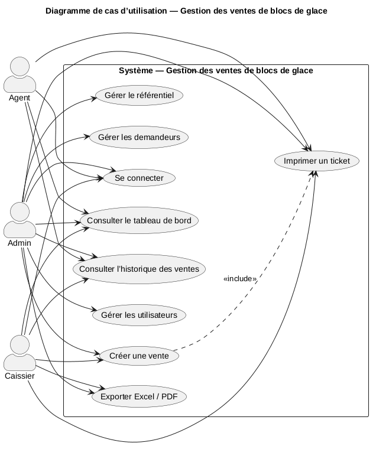
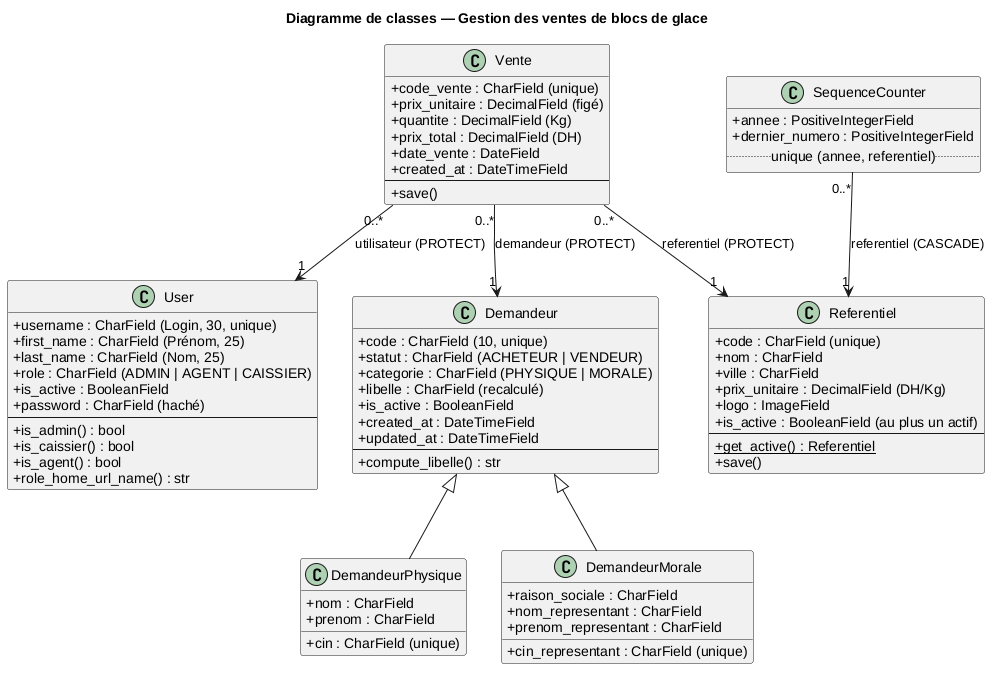
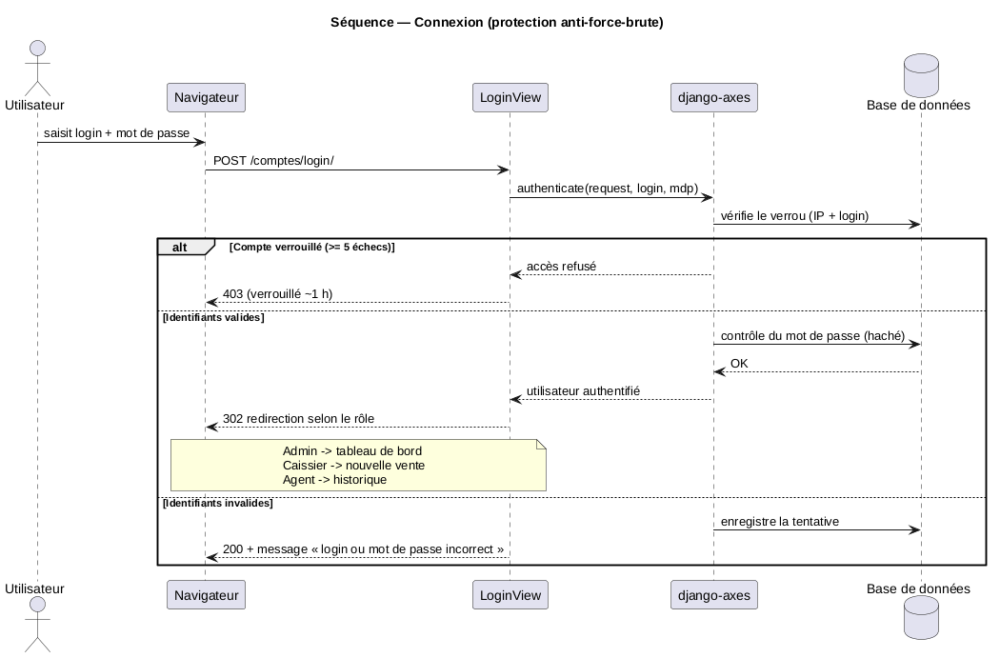
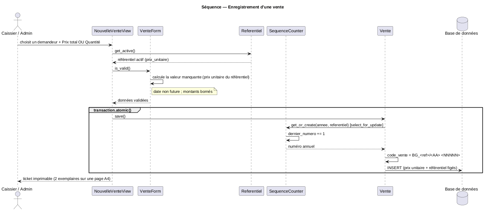
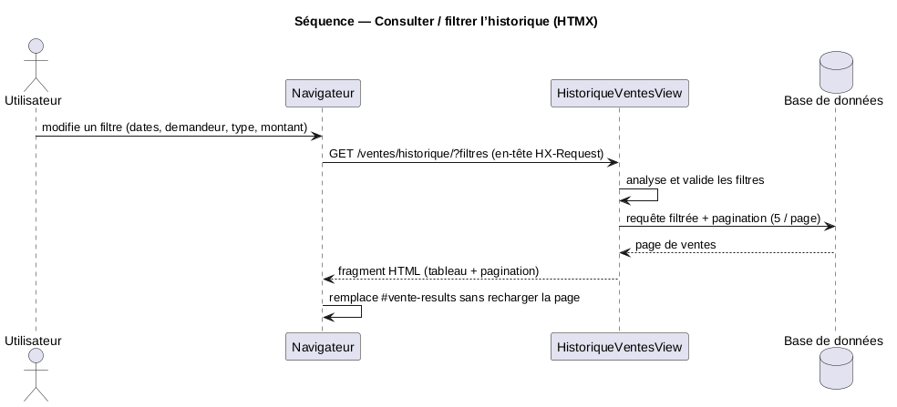

# 📐 Diagrammes UML — Gestion des ventes de blocs de glace

Diagrammes de conception, fournis en **deux formats** :

- **PlantUML** — sources `.puml` compilées en images **PNG** (dossier [`img/`](img/)) → affichées ci-dessous.
- **Mermaid** — fichiers `.md` (rendu automatique sur GitHub / VS Code).

| Diagramme | PlantUML (source) | PNG | Mermaid |
|-----------|-------------------|-----|---------|
| Cas d'utilisation | [`cas-utilisation.puml`](cas-utilisation.puml) | [`img/cas-utilisation.png`](img/cas-utilisation.png) | [`diagramme-cas-utilisation.md`](diagramme-cas-utilisation.md) |
| Classes | [`classes.puml`](classes.puml) | [`img/classes.png`](img/classes.png) | [`diagramme-de-classes.md`](diagramme-de-classes.md) |
| Séquences | [`sequences.puml`](sequences.puml) | `img/sequence-*.png` | [`diagrammes-de-sequence.md`](diagrammes-de-sequence.md) |

---

## 1. Cas d'utilisation


## 2. Classes


## 3. Séquences

### 3.1 Connexion (protection anti-force-brute)


### 3.2 Enregistrement d'une vente


### 3.3 Consulter / filtrer l'historique (HTMX)


---

## Recompiler les diagrammes

Prérequis : **Java**, **PlantUML** et **Graphviz** (`dot`).

```bash
cd docs/diagrammes
plantuml -tpng -o img cas-utilisation.puml classes.puml sequences.puml
# SVG (vectoriel) :
plantuml -tsvg -o img *.puml
```

En ligne (sans installation) : collez le contenu d'un `.puml` sur
[www.plantuml.com/plantuml](https://www.plantuml.com/plantuml).

## Rôles (rappel)

- **Admin** : accès à tout (utilisateurs, référentiel, demandeurs, ventes, exports).
- **Caissier** : création et consultation des ventes, exports.
- **Agent** : consultation seule (tableau de bord + historique).
