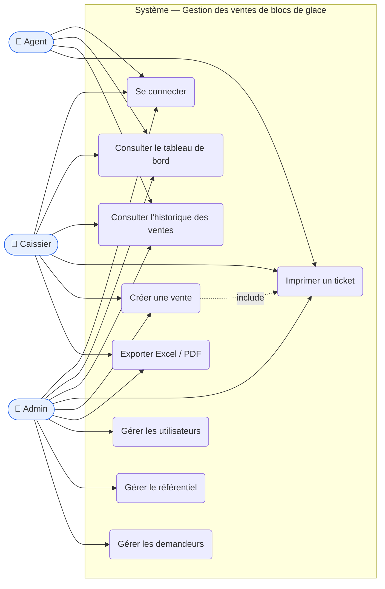

# Diagramme de cas d'utilisation

Acteurs et fonctionnalités de l'application. L'**Admin** hérite des droits de l'Agent
(consultation) ; le **Caissier** peut en plus créer des ventes et exporter.

## Résumé des droits

| Cas d'utilisation | Admin | Caissier | Agent |
|-------------------|:-----:|:--------:|:-----:|
| Se connecter | ✅ | ✅ | ✅ |
| Tableau de bord | ✅ | ✅ | ✅ |
| Historique des ventes | ✅ | ✅ | ✅ |
| Imprimer un ticket | ✅ | ✅ | ✅ |
| Créer une vente | ✅ | ✅ | ❌ |
| Exporter Excel / PDF | ✅ | ✅ | ❌ |
| Gérer les utilisateurs | ✅ | ❌ | ❌ |
| Gérer le référentiel | ✅ | ❌ | ❌ |
| Gérer les demandeurs | ✅ | ❌ | ❌ |
