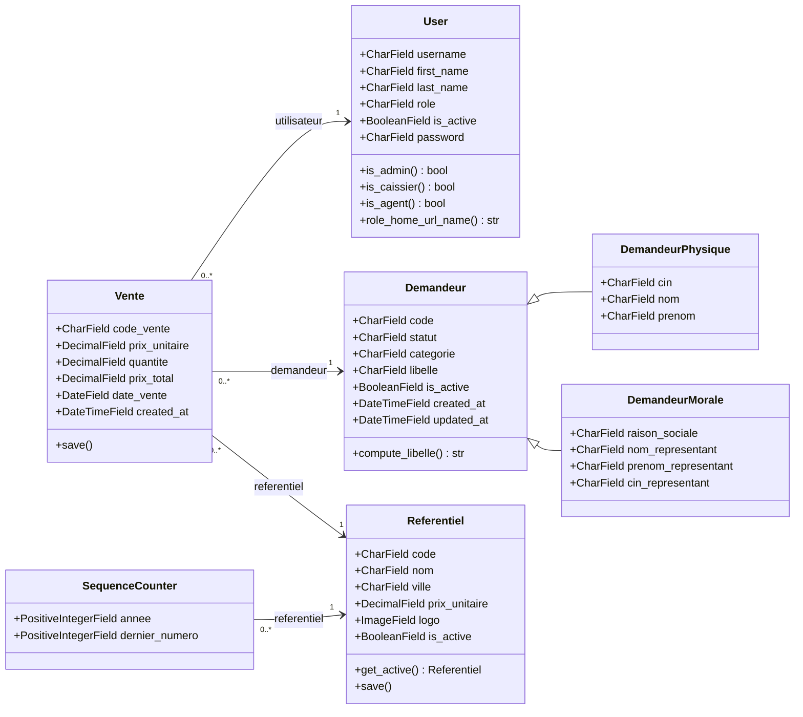

# Diagramme de classes

Modèle de données (apps `accounts`, `demandeurs`, `referentiel`, `ventes`).
Les demandeurs utilisent l'**héritage multi-table** : une base `Demandeur` +
deux sous-classes `DemandeurPhysique` / `DemandeurMorale`.

## Champs & contraintes notables

| Classe | Champ | Contrainte |
|--------|-------|-----------|
| `User` | `username` (Login) | max 30, unique |
| `User` | `first_name` / `last_name` | max 25 |
| `User` | `role` | `ADMIN` \| `AGENT` \| `CAISSIER` |
| `Demandeur` | `code` | max 10, **unique globalement** (table de base) |
| `Demandeur` | `statut` / `categorie` | `ACHETEUR`\|`VENDEUR` / `PHYSIQUE`\|`MORALE` |
| `DemandeurPhysique` | `cin` | unique (normalisé majuscules) |
| `DemandeurMorale` | `cin_representant` | unique |
| `Referentiel` | `code` | unique ; `prix_unitaire` en DH/Kg |
| `Referentiel` | `is_active` | **contrainte DB : au plus un actif** |
| `Vente` | `code_vente` | unique, format `BG_{code_ref}/{AA} {NNNNN}` |
| `SequenceCounter` | (`annee`, `referentiel`) | unique ensemble |

## Règles métier clés

- **Référentiel** : `save()` désactive les autres et se réactive s'il devient le seul actif.
- **Vente** : `prix_unitaire` et `referentiel` sont **figés** (snapshot) à l'enregistrement ;
  `code_vente` est généré via `SequenceCounter` (verrou `select_for_update`, transaction atomique),
  numéroté **par année et par référentiel**.
- **Demandeur** : le `cin` est unique entre les deux sous-types (validation croisée insensible à la casse).
- Toutes les clés étrangères de `Vente` sont en `on_delete=PROTECT` (l'historique reste intègre).
