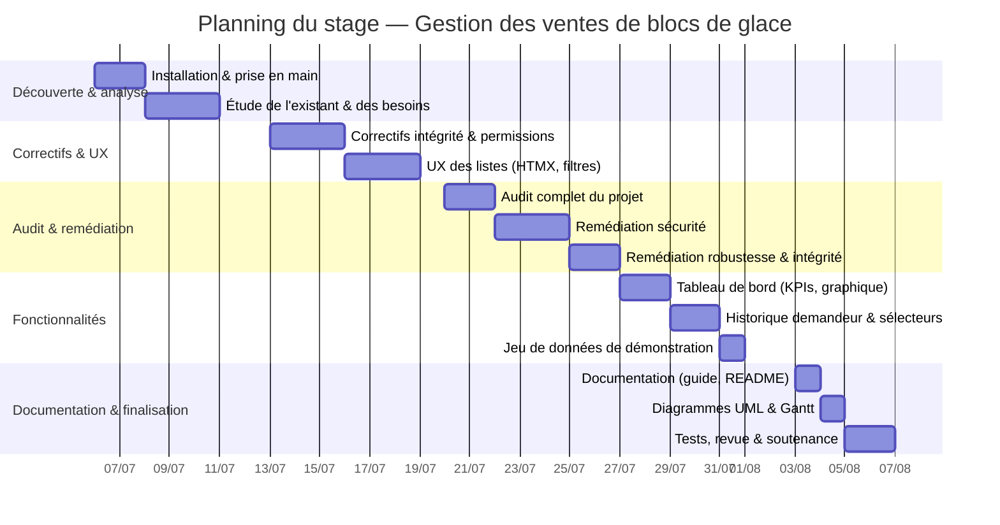

# Diagramme de Gantt — Planning du stage

Période : **06/07/2026 → 06/08/2026** (≈ 5 semaines).

## Détail des phases

| Phase | Période | Livrables |
|-------|---------|-----------|
| Découverte & analyse | 06/07 → 10/07 | Environnement fonctionnel, cadrage des besoins |
| Correctifs & UX | 13/07 → 19/07 | Rôles/permissions, listes HTMX (pagination, filtres, recherche) |
| Audit & remédiation | 20/07 → 26/07 | Audit multi-axes + corrections (sécurité, robustesse, intégrité) |
| Fonctionnalités | 27/07 → 01/08 | Tableau de bord, historique par demandeur, sélecteurs de date, seed |
| Documentation & finalisation | 03/08 → 06/08 | Guide d'installation, README, diagrammes UML + Gantt, tests |
