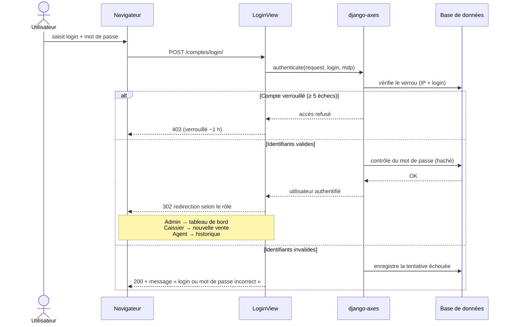
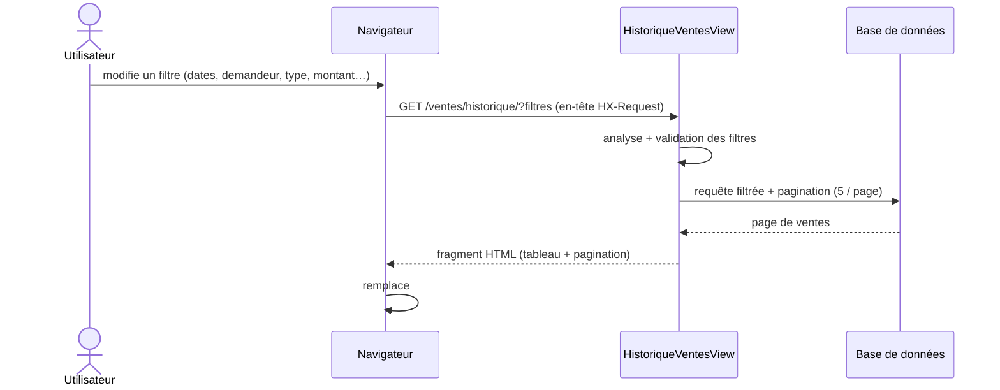

# Diagrammes de séquence

Scénarios principaux de l'application.

## 1. Connexion (avec protection anti-force-brute)



## 2. Enregistrement d'une vente

```mermaid
sequenceDiagram
    actor C as Caissier / Admin
    participant V as NouvelleVenteView
    participant F as VenteForm
    participant R as Referentiel
    participant S as SequenceCounter
    participant VE as Vente
    participant DB as Base de données

    C->>V: choisit un demandeur + saisit Prix total OU Quantité
    V->>R: get_active()
    R-->>V: référentiel actif (prix_unitaire)
    V->>F: is_valid()
    F->>F: calcule l'autre valeur (prix_unitaire du référentiel)
    Note over F: date de vente non future ; montants bornés
    F-->>V: données validées

    rect rgb(235, 244, 255)
    Note over V,DB: transaction.atomic()
    V->>VE: save()
    VE->>S: get_or_create(annee, referentiel) + select_for_update
    S->>S: dernier_numero += 1
    S-->>VE: numéro annuel
    VE->>VE: code_vente = « BG_{code_ref}/{AA} {NNNNN} »
    VE->>DB: INSERT vente (prix_unitaire + référentiel figés)
    end

    V-->>C: ticket imprimable (2 exemplaires sur une page A4)
```

## 3. Consulter / filtrer l'historique (HTMX)


